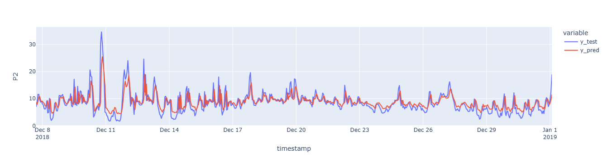

# Nairobi Air Quality Analysis

This project analyzes PM2.5 (P2) air quality data collected in Nairobi using data from a MongoDB collection. It includes data wrangling, visualization, and time-series prediction using a linear regression model.

## Key Steps:
- Data extraction from MongoDB
- Outlier removal and time zone adjustment
- Feature engineering with lag
- Visualization (box plots, scatter, rolling averages)
- Time-series prediction using `LinearRegression`

## PM2.5 Prediction Plot

The following plot compares the predicted vs actual PM2.5 readings:



## Requirements

- `pandas`
- `matplotlib`
- `plotly`
- `pymongo`
- `sklearn`

## How to Run

1. Start your local MongoDB server.
2. Run the script:
```bash
python nairobi_air_quality.py
